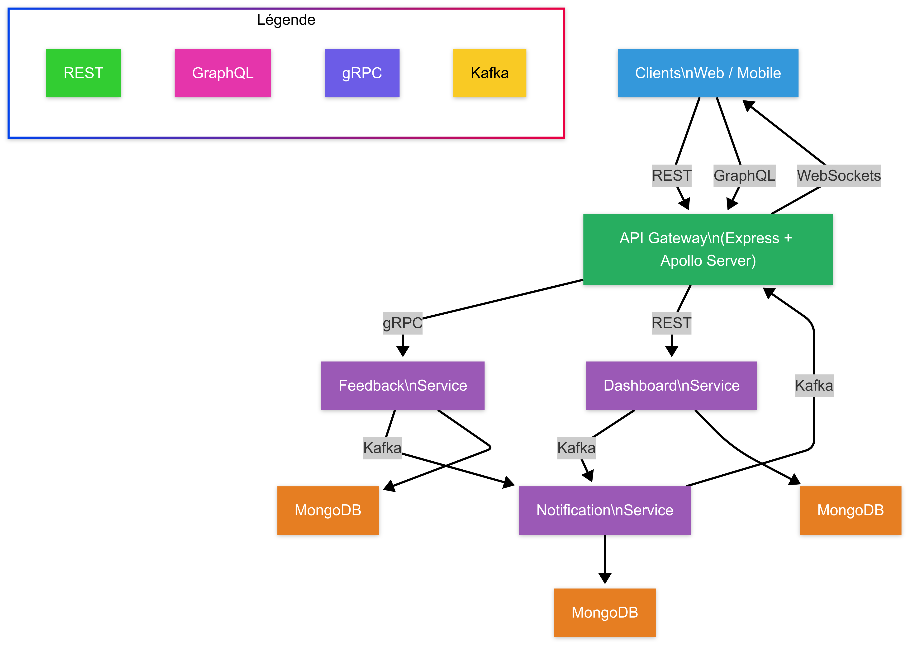

# 🚀 Documentation du Projet de Microservices avec gRPC, REST, GraphQL et Kafka

## 📋 Présentation du Projet

Ce projet démontre la mise en œuvre d'une architecture de microservices moderne utilisant différents protocoles de communication pour répondre à divers besoins techniques. Il s'agit d'un système de gestion de feedback qui illustre comment plusieurs services peuvent interagir efficacement à travers:

- **REST API** : Pour les opérations CRUD simples et la compatibilité universelle
- **GraphQL** : Pour des requêtes flexibles et optimisées
- **gRPC** : Pour la communication inter-services haute performance
- **Kafka** : Pour la communication asynchrone et événementielle
- **WebSockets** : Pour les notifications en temps réel



### 🔑 Points Clés

1. **Architecture Multi-protocoles** : Démonstration de l'intégration de différents protocoles au sein d'un même système
2. **Synchrone et Asynchrone** : Utilisation de méthodes de communication à la fois synchrones (REST, GraphQL, gRPC) et asynchrones (Kafka)
3. **Base de Données par Service** : Chaque service dispose de sa propre base de données MongoDB
4. **Évolutivité** : Architecture conçue pour faciliter l'ajout de nouveaux services et fonctionnalités
5. **Documentation Complète** : Schémas de données, diagrammes d'architecture et guides de test détaillés

### 🎯 Objectifs du Projet

- Illustrer les avantages et cas d'usage de différents protocoles de communication
- Démontrer la mise en œuvre pratique des principes de microservices
- Fournir un exemple concret d'implémentation d'un système distribué
- Servir de référence pour les meilleures pratiques en matière de conception d'API et d'architecture logicielle

## 🏗️ Architecture du Système

```
                    +---------------------+
                    |     API Gateway     | <-- REST / GraphQL / gRPC
                    +---------------------+
                              |
                              v
                 +------------------------+
                 |        gRPC            |
                 |      Communication     |
                 +------------------------+
                              |
     +-------------------------+-------------------------+
     |                                                   |
+------------+                                   +------------+
|  Feedback  |                                   | Dashboard  |
|  Service   | <--------------------------+      |  Service   |
|(REST/gRPC) |                            |      | (GraphQL)  |
+------------+                            |      +------------+
     |                                    |            |
     v                                    |            v
 +--------+        +---------------+      |        +--------+
 |MongoDB |        |Apache Kafka   |------+        |MongoDB |
 +--------+        +---------------+               +--------+
                          |
                          v
                 +------------------+
                 |    WebSockets    |
                 | (Notifications)  |
                 +------------------+
```

## 📋 Description des Microservices

### 1. 🌐 API Gateway (Port 3005)

L'API Gateway sert de point d'entrée central pour le système, permettant aux clients d'interagir avec les services sous-jacents via différents protocoles.

**🔧 Technologies implémentées:**
- ✅ REST API pour l'interface client traditionnelle
- ✅ GraphQL (Apollo Server) pour des requêtes de données flexibles
- ✅ WebSockets pour les notifications en temps réel
- ✅ Client gRPC pour communiquer avec le FeedbackService

**📝 Points d'entrée:**
- 🔄 REST API:
  - `POST /api/feedback` - Soumettre un nouveau feedback
  - `GET /api/feedbacks` - Récupérer tous les feedbacks
  - `GET /api/feedbacks/user/:userId` - Récupérer les feedbacks par utilisateur
  - `GET /api/feedbacks/category/:category` - Récupérer les feedbacks par catégorie
  - `GET /api/feedbacks/score/:minScore` - Récupérer les feedbacks par score minimum

- 🔍 GraphQL: 
  - Endpoint: `/graphql`
  - Queries: 
    - `feedbacks` - Récupérer tous les feedbacks
    - `feedbacksByUser` - Récupérer les feedbacks par utilisateur
    - `feedbacksByCategory` - Récupérer les feedbacks par catégorie
    - `feedbacksByScore` - Récupérer les feedbacks par score
  - Mutations:
    - `submitFeedback` - Soumettre un nouveau feedback

- 🔌 WebSockets:
  - URL: `ws://localhost:3005`
  - Événements: Notifications en temps réel des nouveaux feedbacks

### 2. 💬 FeedbackService (Port 3001 pour REST, Port 50051 pour gRPC)

Service responsable de la gestion des feedbacks utilisateurs, incluant la soumission, le stockage et le traitement.

**🔧 Technologies implémentées:**
- ✅ REST API pour la soumission de feedback
- ✅ Serveur gRPC pour la communication avec l'API Gateway
- ✅ Kafka Producer pour publier des événements de soumission de feedback
- ✅ Kafka Consumer pour traiter les feedbacks (analyse de sentiment, catégorisation)

**📝 Points d'entrée:**
- 🔄 REST API:
  - `POST /api/feedback` - Soumettre un nouveau feedback

- 🔌 gRPC Services:
  - `SubmitFeedback` - Soumettre un nouveau feedback
  - `GetAllFeedbacks` - Récupérer tous les feedbacks
  - `GetFeedbacksByUser` - Récupérer les feedbacks par utilisateur
  - `GetFeedbacksByCategory` - Récupérer les feedbacks par catégorie
  - `GetFeedbacksByScore` - Récupérer les feedbacks par score

**📢 Topics Kafka:**
- `feedback-submitted` - Publié lorsqu'un nouveau feedback est soumis

## 📊 Schémas de Données

### 📄 Feedback

```json
{
  "id": "String (MongoDB ObjectId)",
  "userId": "String",
  "content": "String",
  "category": "String (feature, bug, design, performance, general)",
  "sentiment": "String (positive, negative, neutral)",
  "score": "Number (0.0 - 1.0)",
  "createdAt": "Date ISO String"
}
```

### 📡 Proto Schemas (gRPC)

Le fichier `feedback.proto` définit les services et messages gRPC:

```protobuf
service FeedbackService {
  rpc SubmitFeedback (SubmitFeedbackRequest) returns (SubmitFeedbackResponse);
  rpc GetAllFeedbacks (GetAllFeedbacksRequest) returns (GetAllFeedbacksResponse);
  rpc GetFeedbacksByUser (GetFeedbacksByUserRequest) returns (GetFeedbacksResponse);
  rpc GetFeedbacksByCategory (GetFeedbacksByCategoryRequest) returns (GetFeedbacksResponse);
  rpc GetFeedbacksByScore (GetFeedbacksByScoreRequest) returns (GetFeedbacksResponse);
}
```

### 🔍 GraphQL Schema

```graphql
type Feedback {
  id: ID!
  userId: String!
  content: String!
  category: String
  sentiment: String
  score: Float
  createdAt: String
}

input FeedbackInput {
  userId: String!
  content: String!
}

type SubmitFeedbackResponse {
  id: ID
  success: Boolean
  error: String
}

type Query {
  feedbacks: [Feedback]
  feedbacksByUser(userId: String!): [Feedback]
  feedbacksByScore(minScore: Float!): [Feedback]
  feedbacksByCategory(category: String!): [Feedback]
}

type Mutation {
  submitFeedback(input: FeedbackInput!): SubmitFeedbackResponse
}
```

## 🔄 Interactions entre les Microservices

### 1. 📤 Soumission de Feedback

1. Le client soumet un feedback via l'API Gateway (REST ou GraphQL)
2. L'API Gateway transmet la demande au FeedbackService via gRPC
3. Le FeedbackService enregistre le feedback dans MongoDB
4. Le FeedbackService publie un événement sur le topic Kafka `feedback-submitted`
5. L'API Gateway reçoit l'événement Kafka et notifie les clients connectés via WebSockets

### 2. ⚙️ Traitement de Feedback

1. Le Kafka Consumer du FeedbackService écoute le topic `feedback-submitted`
2. Quand un nouveau feedback est publié, le Consumer effectue l'analyse de sentiment et la catégorisation
3. Le feedback est mis à jour dans MongoDB avec les données d'analyse
4. Les clients peuvent voir le feedback traité via les requêtes REST ou GraphQL

### 3. 🔍 Consultation de Feedback

1. Le client demande des feedbacks via l'API Gateway (REST ou GraphQL)
2. L'API Gateway transmet la demande au FeedbackService via gRPC
3. Le FeedbackService récupère les données de MongoDB et les renvoie à l'API Gateway
4. L'API Gateway formate et renvoie les données au client

## 🧪 Guide de Test

### ✅ Tester REST API

Utilisez Postman ou curl pour tester les endpoints REST:

1. **Soumettre un Feedback:**
   ```
   POST http://localhost:3005/api/feedback
   Content-Type: application/json
   
   {
     "userId": "user123",
     "content": "This is a great feature, I love it!"
   }
   ```

2. **Récupérer tous les Feedbacks:**
   ```
   GET http://localhost:3005/api/feedbacks
   ```

3. **Récupérer les Feedbacks par Utilisateur:**
   ```
   GET http://localhost:3005/api/feedbacks/user/user123
   ```

4. **Récupérer les Feedbacks par Catégorie:**
   ```
   GET http://localhost:3005/api/feedbacks/category/feature
   ```

5. **Récupérer les Feedbacks par Score:**
   ```
   GET http://localhost:3005/api/feedbacks/score/0.7
   ```

### 🔍 Tester GraphQL

1. Ouvrez Apollo Studio Explorer à l'adresse: `http://localhost:3005/graphql`

2. **Requête pour Tous les Feedbacks:**
   ```graphql
   {
     feedbacks {
       id
       userId
       content
       category
       sentiment
       score
       createdAt
     }
   }
   ```

3. **Requête pour les Feedbacks par Utilisateur:**
   ```graphql
   query($userId: String!) {
     feedbacksByUser(userId: $userId) {
       id
       content
       category
       sentiment
       score
     }
   }
   ```
   Variables:
   ```json
   {
     "userId": "user123"
   }
   ```

4. **Requête pour les Feedbacks par Catégorie:**
   ```graphql
   query($category: String!) {
     feedbacksByCategory(category: $category) {
       id
       userId
       content
       score
     }
   }
   ```
   Variables:
   ```json
   {
     "category": "feature"
   }
   ```

5. **Mutation pour Soumettre un Feedback:**
   ```graphql
   mutation($input: FeedbackInput!) {
     submitFeedback(input: $input) {
       id
       success
       error
     }
   }
   ```
   Variables:
   ```json
   {
     "input": {
       "userId": "user456",
       "content": "I found a bug in the application"
     }
   }
   ```

### 📡 Tester gRPC

Pour tester gRPC avec Postman:

1. Ouvrez Postman et créez une nouvelle requête gRPC
2. Connectez-vous à `localhost:50051`
3. Importez le fichier proto `proto/feedback.proto`
4. Sélectionnez le service `FeedbackService` et la méthode à tester

Pour `SubmitFeedback`:
```json
{
  "userId": "user123",
  "content": "Testing with gRPC"
}
```

Pour `GetFeedbacksByUser`:
```json
{
  "userId": "user123"
}
```

### 📢 Tester Kafka

Kafka est utilisé en interne pour:

1. Communication entre le FeedbackService et son processeur de feedback (analyse de sentiment)
2. Communication entre le FeedbackService et l'API Gateway pour les notifications en temps réel

Pour visualiser les messages Kafka, vous pouvez utiliser un outil comme Kafka UI, Conduktor ou AKHQ.

## ⚙️ Prérequis pour Exécuter le Projet

1. **Node.js** (v14+)
2. **MongoDB** fonctionnant sur `localhost:27017`
3. **Kafka** fonctionnant sur `localhost:9092`

## 🚀 Démarrage du Projet

1. **Installer les dépendances:**
   ```
   npm install
   cd FeedbackService && npm install
   cd ../apiGateway && npm install
   ```

2. **Démarrer les services:**
   ```
   npm start
   ```

## 🏗️ Choix d'Architecture et Défis Rencontrés

### 🎯 Choix d'Architecture

1. **🌐 API Gateway Pattern**: Centralise l'accès aux services et simplifie l'interaction client.
2. **🔄 Multiprotocole**: Utilisation de REST, GraphQL et gRPC pour tirer parti des avantages de chaque protocole:
   - REST pour la simplicité et la compatibilité
   - GraphQL pour des requêtes flexibles et la réduction du sur-fetching
   - gRPC pour une communication haute performance entre services
3. **📢 Communication Événementielle**: Utilisation de Kafka pour découpler les services et permettre le traitement asynchrone
4. **🔌 WebSockets**: Pour les notifications en temps réel aux clients

### 🧩 Défis Rencontrés

1. **📊 Configuration de Kafka**: Mise en place et gestion des brokers Kafka
2. **🔄 Intégration des Protocoles**: Faire fonctionner ensemble REST, GraphQL et gRPC
3. **📦 Gestion des Dépendances**: S'assurer que tous les services disposent des dépendances requises
4. **⏱️ Traitement Asynchrone**: Implémentation du traitement asynchrone des feedbacks
5. **🧪 Tests Multiprotocoles**: Configuration et mise au point des outils de test pour différents protocoles

## 🎯 Conclusion

Ce projet démontre l'utilisation de plusieurs protocoles de communication (REST, GraphQL, gRPC) et d'un système de messagerie événementielle (Kafka) dans une architecture de microservices. 

L'architecture choisie permet:
- 🔄 Une flexibilité dans les interactions client-serveur (REST, GraphQL)
- ⚡ Une communication haute performance entre services (gRPC)
- ⏱️ Un traitement asynchrone des données (Kafka)
- 🔔 Des notifications en temps réel (WebSockets)

Ces choix technologiques permettent de construire un système robuste, évolutif et réactif qui peut être étendu avec de nouveaux services et fonctionnalités. 